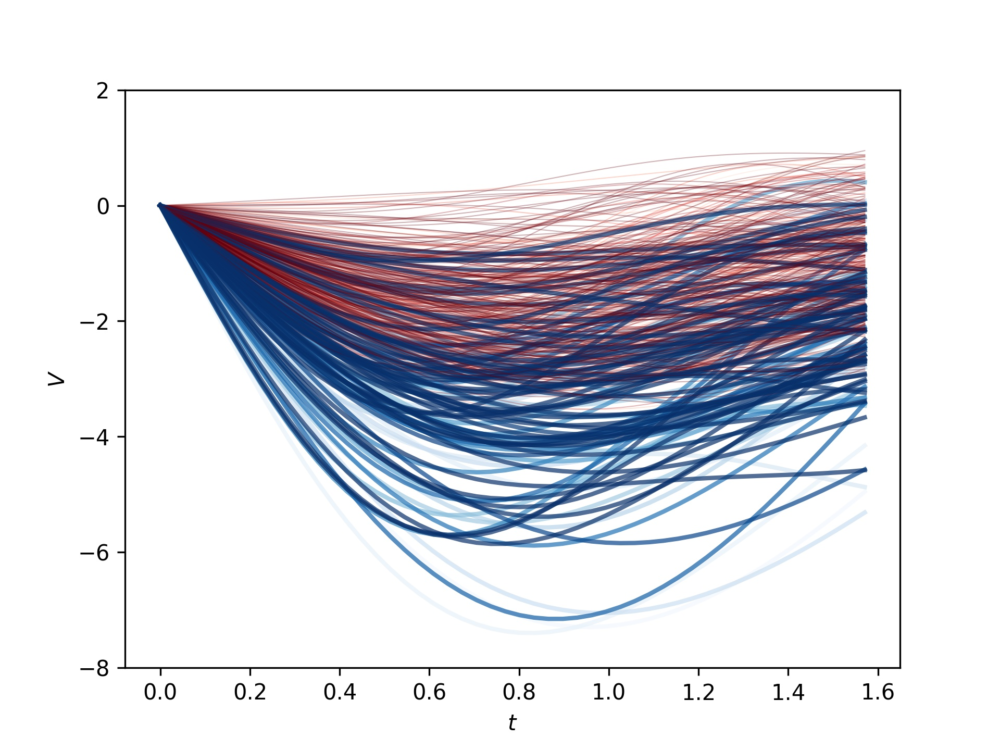
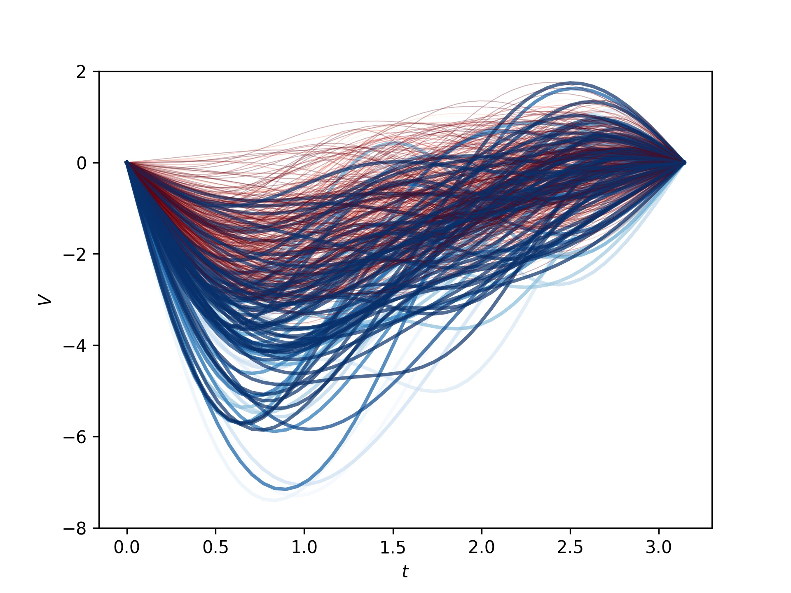
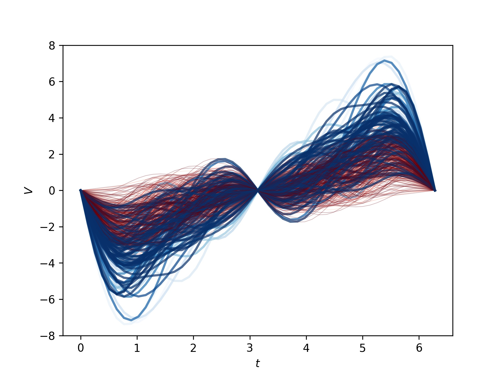
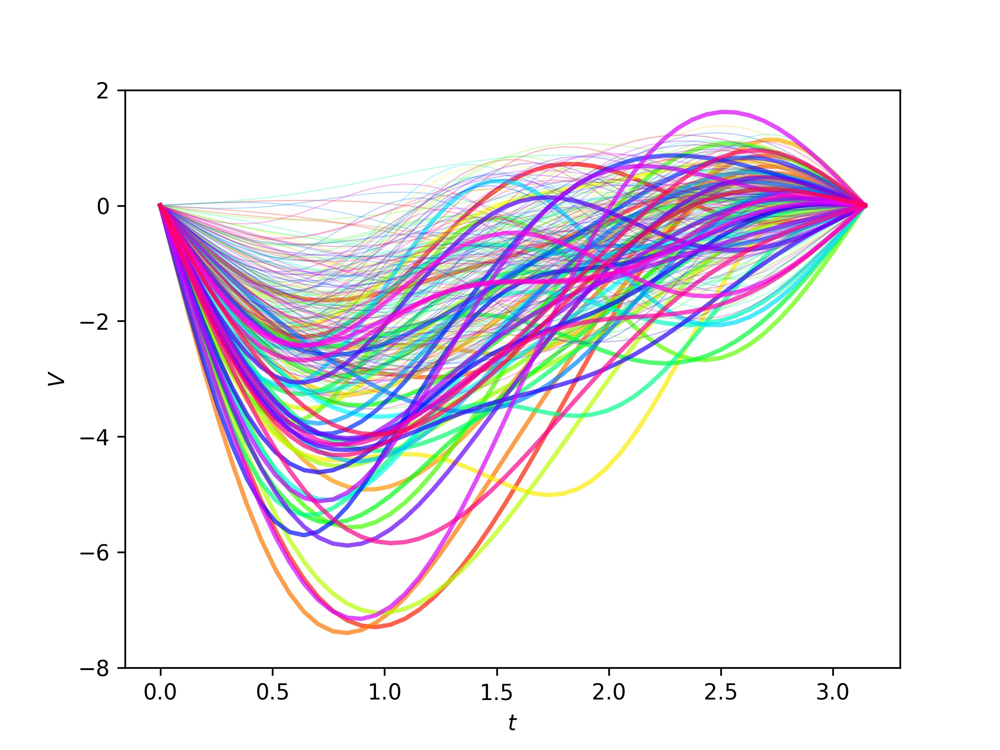

# EtaNet
Implementations of EtaNet - a translational Quantum Machine Intelligence for Modeling Tumor Dynamics in Oncology. Pre-print: (Update Soon)
## Neural Architecture of EtaNet

## Model Capacity

## Experiment History

## Some Illustration

[width = 300]



## Requirement
```
python >= 3.6.12, pennylane == 0.13.0, multiprocessing == 2.6.2.1, optuna == 2.4.0, scipy == 1.5.4
```
## Code usage
Training Model End-to-end
```
cd code
python main.py
```
