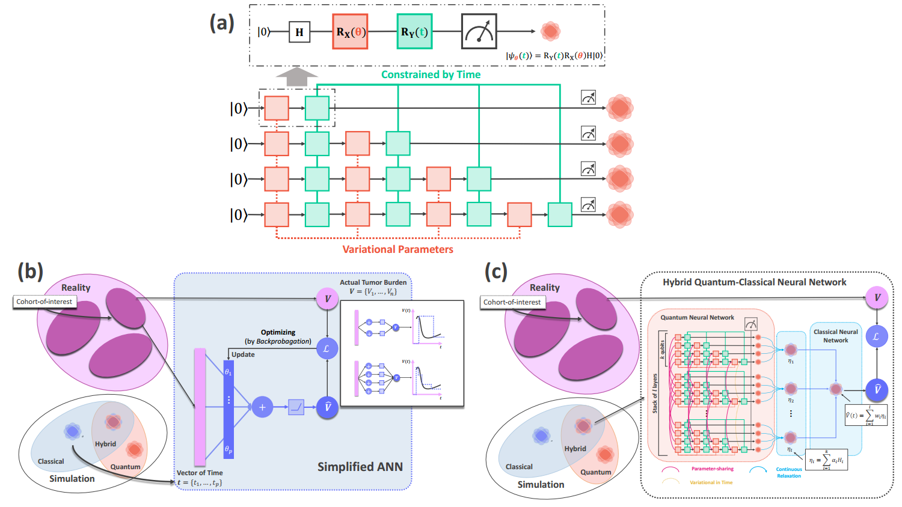
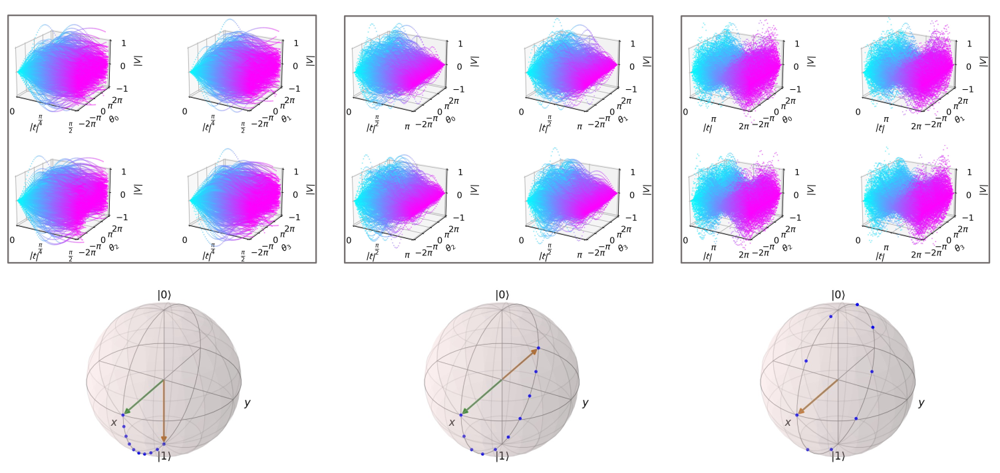

# EtaNet: Translational Quantum Machine Intelligence for Modeling Tumor Dynamics in Oncology
Implementations of EtaNet - a translational Quantum Machine Intelligence for Modeling Tumor Dynamics in Oncology. Pre-print: (Update Soon)
## Abstract
Quantifying the dynamics of tumor burden reveals useful information about cancer evolution concerning treatment effects and drug resistance, which play a crucial role in advancing model-informed drug developments (MIDD) towards personalized medicine and precision oncology. The emergence of Quantum Machine Intelligence offers unparalleled insights into tumor dynamics via a quantum mechanics perspective. This paper introduces a novel hybrid quantum-classical neural architecture named -Net that enables quantifying quantum dynamics of tumor burden concerning treatment effects. We evaluate our proposed neural solution on two major use cases, including cohort-specific and patient-specific modeling. In silico numerical results show a high capacity and expressivity of -Net to the quantified biological problem. Moreover, the close connection to representation learning - the foundation for successes of modern AI, enables efficient transferability of empirical knowledge from relevant cohorts to targeted patients. Finally, we leverage Bayesian optimization to quantify the epistemic uncertainty of model predictions, paving the way for -Net towards reliable AI in decision-making for clinical usages.
## Introduction 
Tumor dynamics modeling is one of the most common model-informed drug development (MIDD) approaches in oncology, which could enable significant insights into the heterogeneity of inter-/intratumor and cancer evolution. Understanding the drug resistance evolution of tumors could be the key to achieving personalized treatment and precision oncology, which are vital quests in cancer research. Mathematical modeling is one of the most dominant approaches to quantify such evolution, which has been studied since 1970s. It is worth emphasizing that these methodologies laid the foundations on classical physics. Modern society has witnessed an emergence of Artificial Intelligence (AI) and Quantum Computing hardware, which gives rise to Quantum Machine Intelligence. On the one hand, AI has penetrated every aspect of life: it can be fit in palms of hands as Machine Translation AI, it can auto-operate on the street as self-driving vehicles, or it can approach efficiently (but not yet solved) the problem of protein folding. On the other hand, the recent advances in Quantum Computing (QC) enable Quantum Simulation (QS) on conventional computers empowered by Central Process Units (CPUs), Graphical Processing Units (GPUs), or Tensor Processing Units (TPUs). As a result, Quantum Machine Intelligence or Quantum Machine Learning (QML) can be studied within computations of classical computers in the hope of creating algorithms that can make reasoning with powerful calculations of Quantum computers. These algorithms are so-called Noisy intermediate-scale Quantum (NISQ) algorithms, in which quantum processors deliver the algorithmic solutions in the NISQ era. The surge of Quantum Machine Intelligence enables computational tools that offer us a completely new insight into cancer evolution via quantum mechanics.
## Neural Architecture of EtaNet

## Model Capacity

## Bayesian inference of EtaNet


## Experiment Results
### Cohort-specific Modeling
<a href="url"></a>
### Patient-specific Modeling
<a href="url"></a>
## Experiment History
[k = 4, l = 4](https://drive.google.com/drive/folders/1WmFoZk8th_rQBAJlnwNVdwdAFWbf0fEr?usp=sharing)
[k = 4, l = 6](https://drive.google.com/drive/folders/1VURc4iC0ZS3GsrQcjQMjVTR-5qf_Jt6f?usp=sharing)
[k = 4, l = 8](https://drive.google.com/drive/folders/1jxYqb5_ztVKrjgao4v2v6ml9tDUN9w2j?usp=sharing)
[k = 6, l = 4](https://drive.google.com/drive/folders/1PYyzv5A72X_CDVpbi3f0ir5XFdsVgRnH?usp=sharing)
[k = 6, l = 6](https://drive.google.com/drive/folders/1l1aMwTJ8Wd7VoG8wh3daBEkRkuwOUoN9?usp=sharing)
[k = 6, l = 8](https://drive.google.com/drive/folders/1bkOcDuIn6EeqSs_aLzCNjmxqp1pv2koj?usp=sharing)
[k = 8, l = 4](https://drive.google.com/drive/folders/15VEu1mq6MDH6ExGjQ_wEYMtCELZ8RMj_?usp=sharing)
[k = 8, l = 6](https://drive.google.com/drive/folders/1XrJzalV-FDwbC1BBv3myX1cuomHRGDyj?usp=sharing)
[k = 8, l = 8](https://drive.google.com/drive/folders/1BD504vnb_odGHR49xdtbvjP-jiQjDdUP?usp=sharing)
## Some Arts - Colored by Quantum (Red) - Classical (Blue) Weights and Rainbow Plots of -Net
<a href="url"></a>
<a href="url"></a>
<a href="url"></a>
<a href="url"></a>

## Requirement
```
python >= 3.6.12, pennylane == 0.13.0, multiprocessing == 2.6.2.1, optuna == 2.4.0, scipy == 1.5.4
```
## Code usage
Training Model End-to-end
```
cd code
python main.py
```
